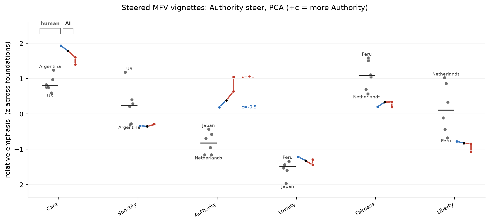
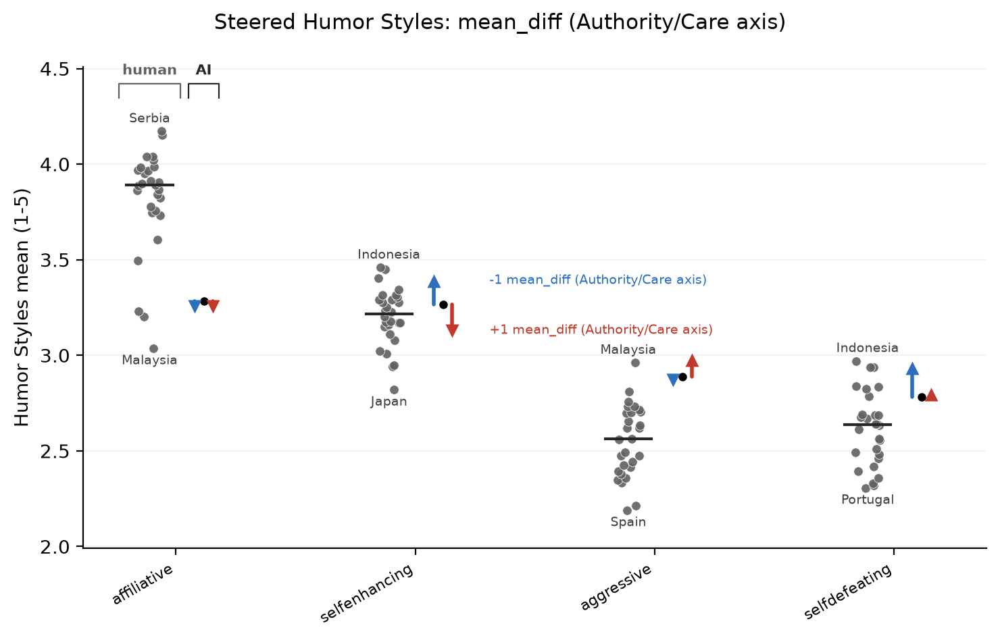
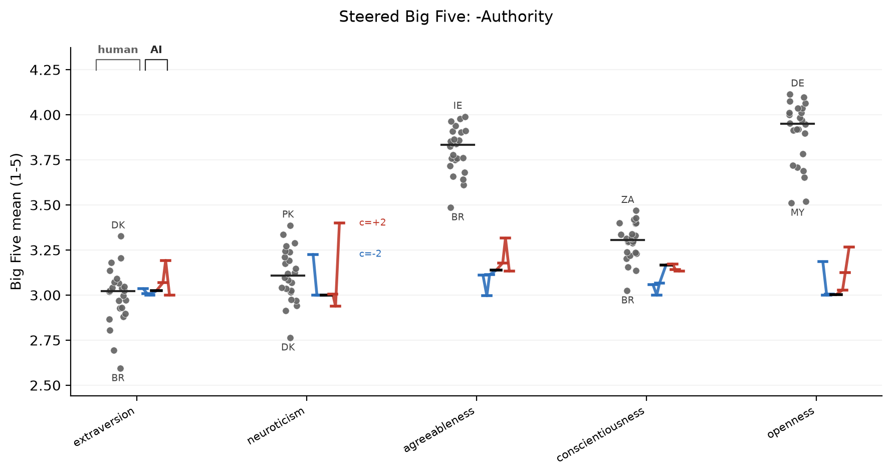

# tinymfv

tinymfv is a small set of fast value evals for local LLM steering work. It asks moral vignettes and survey questions, reads answer-token probabilities, and turns them into model profiles that you can compare to humans.

When comparing models or checkpoints you can use it to check three things: did the intended value move?, what else moved?, how does this compare to human responses? The evals are quick and sensitive enough to show probability shifts.

## The plots - Are model moral aliens?

One fun thing we can do with this repo is compare AI's models on human psychological and anthropological surveys. Are they like us?

One thing jumps out of the plots below. Before any steering the base model is already a psychological alien on some axes: on the culture maps it sits away from most humans, most sharply on Big5 openness (low) and conscientiousness (high), and on humor style (high aggressive, low affiliative). And steering is strong relative to human variation, on the headline axes a single sweep moves the profile further than any two countries differ, not just a US-vs-Australia nudge.

What happens when we steer them? Below we steer models with `authority-respecting` versus `authority-disregarding` personas.

<!-- TODO introduce what MFV is -->


<!-- caption / interp sequence. how it's measured. -->



Steering from blue (`-c`, less Authority) to red (`+c`, more Authority) lifts the Authority foundation most: `+1.82` nat on the Authority reader-logit and `+401%` of a human country SD in foundation emphasis, with the other foundations dropping as it rises. The map places the base model (black) against human societies (gray), with the red/blue steering path running through it.

MFV uses the same map and range plotters as the surveys, after converting forced-choice foundation probabilities into relative foundation emphasis. Each profile is z-scored across foundations before mapping, so the plot compares which foundations are high or low within that profile.




The value ("quadrant") map is the clearest read: named axes instead of blind PCs, maladaptive-to-adaptive humor left to right and other- to self-directed bottom to top, with the four human zones as convex hulls. Here the zones overlap almost completely, so humor style does not sort societies the way values do, a real negative result.


The blind-PCA version shows the same failure mode more sharply: the model profile can live away from the human societies. That is the useful warning sign, a model can answer in the requested format and still be a moral or psychological alien on the measured profile.




On named axes: reserved-to-exploratory left to right (Plasticity = extraversion + openness), volatile-to-stable bottom to top (Stability = agreeableness + conscientiousness + emotional stability), the two DeYoung meta-traits. The Authority steer barely moves the base here, matching the flat range plot: this is a values push, not a personality one.


Read the blind-PCA map left to right: gray is the human reference, black is the base LLM, and the red/blue line is the coherent steering path. Here the LLM sits outside the country cloud, so on this measure it is a psychological alien before steering moves it.

MFQ-2 means Moral Foundations Questionnaire 2, the short survey instrument. It is separate from MFV, the moral-vignette foundation reader. MFQ-2 has fewer items per axis than the longer personality surveys, so the showcase averages 8 sampled reads per item before treating small path wiggles as signal.


The value map is the sharpest of the set: individualizing-to-binding morality left to right, the fairness split (equality-to-proportionality) bottom to top, on the same convention as the WVS map (cultural West to the west, African-Islamic to the south). The `+c` Authority steer walks the base out of the Western individualizing corner across to the binding zone shared by the African-Islamic and East-Asian societies.


The path shows only usable coefficients: `c=0`, then each positive and negative side until one of the plot gates fails. This run kept the full path `c=-1,-0.5,0,+0.5,+1`. For surveys, collapse can mean the answer distribution loses its factor structure even when answer mass stays high.


## Install

```bash
uv pip install git+https://github.com/wassname/tinymfv
```

For maps:

```bash
uv pip install "tiny-mfv[maps] @ git+https://github.com/wassname/tinymfv"
```

For repo development:

```bash
git clone https://github.com/wassname/tinymfv
cd tinymfv
uv sync --extra maps --dev
just smoke
```

## Datasets

| dataset | bundled data | human reference | profile used in plots |
|---|---|---|---|
| MFV classic | [132 moral vignettes, other](src/tinymfv/data/vignettes_classic_other_violate.jsonl) / [self](src/tinymfv/data/vignettes_classic_self_violate.jsonl) | per-vignette human foundation labels in the JSONL | forced-choice foundation probability profile |
| MFV scifi | [same items rewritten as sci-fi, other](src/tinymfv/data/vignettes_scifi_other_violate.jsonl) / [self](src/tinymfv/data/vignettes_scifi_self_violate.jsonl) | inherited labels from classic MFV | forced-choice foundation probability profile |
| MFV ai-actor | [same items rewritten with an AI actor, other](src/tinymfv/data/vignettes_ai-actor_other_violate.jsonl) / [self](src/tinymfv/data/vignettes_ai-actor_self_violate.jsonl) | inherited labels from classic MFV | forced-choice foundation probability profile |
| MFQ-2 | [36 items](src/tinymfv/data/surveys/mfq2/forward.json), plus inverted and negated frames | [country means](src/tinymfv/data/human/mfq2_country_foundations.csv), plus [raw respondents](src/tinymfv/data/atari_study2_raw.csv) | expected 1-5 score per foundation |
| Big Five | [50 items](src/tinymfv/data/surveys/big5/questionnaire.json), plus inverted and negated frames | [country means](src/tinymfv/data/human/big5_country_factors.csv) | expected 1-5 score per trait |
| 16PF | [162 items](src/tinymfv/data/surveys/16pf/questionnaire.json), plus inverted and negated frames | [country means](src/tinymfv/data/human/16pf_country_factors.csv) | expected 1-5 score per factor |
| Humor Styles | [32 items](src/tinymfv/data/surveys/humor_styles/questionnaire.json), plus inverted and negated frames | [country means](src/tinymfv/data/human/humor_styles_country_factors.csv), originally 1-7 | expected 1-5 score per style |

MFV uses categorical answers: the answer is the foundation. The survey instruments use ordinal answers: the answer is a scale point.

Each MFV item is asked in two perspectives, `other_violate` and `self_violate`. Each survey item is asked three ways, forward, scale-inverted, and content-negated. tinymfv canonicalizes these frames before averaging, so the profile is less tied to one wording.

## API

Run MFV vignettes with `evaluate`:

```python
from transformers import AutoModelForCausalLM, AutoTokenizer
from tinymfv import evaluate, load_vignettes

tok = AutoTokenizer.from_pretrained("Qwen/Qwen3-4B")
model = AutoModelForCausalLM.from_pretrained("Qwen/Qwen3-4B").cuda()

vignettes = load_vignettes("classic")  # "classic", "scifi", "ai-actor", or "all"
report = evaluate(model, tok, vignettes=vignettes)

print(report["profile"])              # mean forced-choice probability per foundation
print(report["mean_pmass_allowed"])   # format check: mass on valid answer tokens
```

Run survey instruments with `administer`:

```python
from transformers import AutoModelForCausalLM, AutoTokenizer
from tinymfv import administer, get_instrument

tok = AutoTokenizer.from_pretrained("Qwen/Qwen3-4B")
model = AutoModelForCausalLM.from_pretrained("Qwen/Qwen3-4B").cuda()

instr = get_instrument("mfq2")  # "mfq2", "big5", "16pf", or "humor_styles"
report = administer(model, tok, instr)

print(report["dimensions"])
print(report["profile"])                  # expected 1-5 score per factor
print(report["mean_pmass_allowed"])       # format check: mass on valid answer tokens
```

Generate the bundled range plots and culture maps from a steering-lite all-instrument run:

```bash
uv run python scripts/plot_steer_showcase.py \
  --run-dir ../steering-lite/outputs/20260630T222000Z_pure_authority_mundane15_pca_readme_mfv_mfq2_humor_big5_n8 \
  --out docs/img/showcase \
  --vec-label "Authority steer, PCA (+c = more Authority)" \
  --coherence-frac 0.99 \
  --contrast-frac 0.000001 \
  --margin-frac 0.50
```

The plot gate keeps only coefficients that all plotted instruments can still read. A row passes when answer mass, survey rank-logit contrast, and MFV top-foundation margin stay above the requested fraction of their base values: `pmass(c)/pmass(0) >= coherence-frac`, `mean_abs_C(c)/mean_abs_C(0) >= contrast-frac`, and `mean_margin(c)/mean_margin(0) >= margin-frac`.

## Measurement

The measurement on the maps is the profile.

For MFV, the profile is the model's mean forced-choice probability on each moral foundation:

$$\mathrm{profile}_f = \mathbb{E}_i P(f \mid i)$$

For survey instruments, the profile is the mean expected 1-5 answer for each factor, after reverse-keying:

$$\mathrm{profile}_d = \mathbb{E}_{i \in d}\sum_{k=1}^{M} k P(k \mid i)$$

where $i$ is an item, $d$ is a survey factor, $k$ is a scale point, and $M$ is the largest scale value.

This is what the survey maps and range plots show. In the showcase CSVs, this is the `mean` column. For MFV showcase plots, model and human units differ, so the plotted quantity is relative foundation emphasis: each foundation profile is z-scored across foundations before mapping.

The table's reader-logit shift uses a more sensitive log-space readout.

For MFV:

$$\Delta_f = \mathbb{E}_i \left(\ell_{i,f}^{(+1)} - \ell_{i,f}^{(-1)}\right)$$

where $\ell_{i,f}^{(c)}$ is the forced-choice logit for foundation $f$ on item $i$ at coefficient $c$.

For survey instruments:

$$C_d(c) = \mathbb{E}_{i \in d}\sum_{k=1}^{M} \left(k - \frac{M+1}{2}\right)\ell_{i,k}^{(c)}$$

and the table reports $C_d(+1)-C_d(-1)$.

For paired steering runs, compare the base profile to the steered profile path. Answer mass is a coherence check, not a value score:

$$m(c) = \mathbb{E}_i \sum_{a \in A_i} P_c(a \mid i)$$

where $A_i$ is the valid answer-token set for item $i$. The showcase also checks survey rank-logit contrast and MFV top-foundation margin, because a steered reader can keep answer mass while losing useful structure.

## Scope

tinymfv is for fast paired steering comparisons, not full moral reasoning evaluation. It is useful when you want to compare base, positive-steer, and negative-steer runs against the same human reference plots.

For behavior-heavy moral evals, see [machiavelli](https://huggingface.co/datasets/wassname/machiavelli), [AIRiskDilemmas](https://huggingface.co/datasets/kellycyy/AIRiskDilemmas), and [ethics_expression_preferences](https://huggingface.co/datasets/wassname/ethics_expression_preferences).

Used in [steering-lite](https://github.com/wassname/steering-lite), [lora-lite](https://github.com/wassname/lora-lite), and [w2schar-mini](https://github.com/wassname/w2schar-mini).

## Citation

```bibtex
@misc{clark2026tinymfv,
  title = {tinymfv: tiny moral/value eval for local LLMs},
  author = {Michael Clark},
  year = {2026},
  url = {https://github.com/wassname/tinymfv/}
}
```
