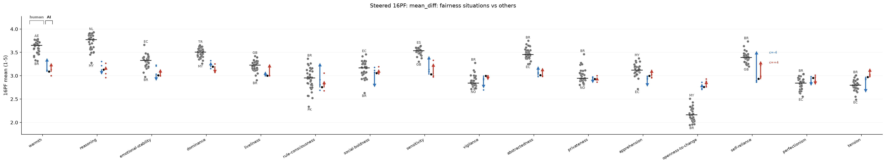
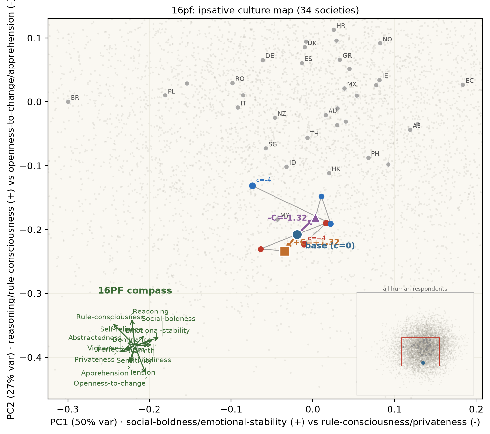

# tinymfv

tinymfv is a small set of quick value evals for local LLM steering work. It is sensitive to small answer-probability shifts, so you can see movement before sampled answers flip.

It asks moral vignettes and survey questions, reads the model's answer probabilities, and compares the model profile to human responses. The main use case is simple: after you steer a model, did the intended values move, did nearby values move too, and does the result still look like a coherent answer?

Range plots show where the model sits relative to human societies. Culture maps show the base model and steered models on a PCA map of human response profiles.







The plotting script defaults to clean base / +C / -C maps; use `--show-sweep` when you want the diagnostic `c=-4..+4` trajectory.

## Install

```bash
uv pip install git+https://github.com/wassname/tinymfv
```

For maps:

```bash
uv pip install "tiny-mfv[maps] @ git+https://github.com/wassname/tinymfv"
```

For repo development:

```bash
git clone https://github.com/wassname/tinymfv
cd tinymfv
uv sync --extra maps --dev
just smoke
```

## Datasets

| dataset | what it asks | model answer | human comparison |
|---|---|---|---|
| MFV classic | 132 Moral Foundations Vignettes from Clifford et al. | one of 7 foundations: Care, Fairness, Loyalty, Authority, Sanctity, Liberty, Social Norms | per-vignette human foundation labels |
| MFV scifi | the same MFV items rewritten as sci-fi scenarios | one of 7 foundations | inherited labels from the classic item |
| MFV ai-actor | the same MFV items rewritten so an AI system is the actor | one of 7 foundations | inherited labels from the classic item |
| MFQ-2 | 36 Moral Foundations Questionnaire items | 1-5 agreement | country foundation means, plus raw Atari et al. respondent data |
| Big Five | 50 personality items | 1-5 agreement | country factor means |
| 16PF | 162 personality items | 1-5 agreement | country factor means |
| Humor Styles | 32 humor-style items | 1-5 agreement | country style means, originally on a 1-7 scale |

MFV is nominal: the answer is the category. The survey instruments are ordinal: the answer is a scale point.

Each MFV item is asked in two perspectives, `other_violate` and `self_violate`. Each survey item is asked three ways, forward, scale-inverted, and content-negated. tinymfv canonicalizes these frames before averaging, so the profile is less tied to one wording.

## API

Run MFV vignettes with `evaluate`:

```python
from transformers import AutoModelForCausalLM, AutoTokenizer
from tinymfv import evaluate, load_vignettes

tok = AutoTokenizer.from_pretrained("Qwen/Qwen3-4B")
model = AutoModelForCausalLM.from_pretrained("Qwen/Qwen3-4B").cuda()

vignettes = load_vignettes("classic")  # "classic", "scifi", "ai-actor", or "all"
report = evaluate(model, tok, vignettes=vignettes, return_per_row=True)

print(report["profile"])              # mean probability per foundation
print(report["informedness"])         # chance-corrected argmax agreement with human labels
print(report["mean_pmass_allowed"])   # mean valid-answer mass across rows
print(report["per_row"][0]["score"])  # foundation logprobs, in nats
```

Run survey instruments with `administer`:

```python
from transformers import AutoModelForCausalLM, AutoTokenizer
from tinymfv import administer, get_instrument

tok = AutoTokenizer.from_pretrained("Qwen/Qwen3-4B")
model = AutoModelForCausalLM.from_pretrained("Qwen/Qwen3-4B").cuda()

instr = get_instrument("mfq2")  # "mfq2", "big5", "16pf", or "humor_styles"
report = administer(model, tok, instr)

print(report["dimensions"])
print(report["profile_E"])                # expected survey score, for human comparison
print(report["profile_C"])                # log contrast, for steering deltas
print(report["per_item_frame"][0]["lp"])  # raw answer-token logprobs
```

Generate the bundled range plots and culture maps from a steering-lite all-instrument run:

```bash
uv run python scripts/plot_steer_showcase.py \
  --run-dir ../steering-lite/outputs/allinstr_qwen35_4b \
  --out docs/img/showcase
```

## Metrics

There are two metric families: human-comparison metrics for maps and logprob metrics for steering deltas.

### Moral foundation profile (`profile`)

For MFV, the profile is the mean probability of each foundation:

$$p_f = \mathbb{E}_i\,P(f \mid i)$$

Use this for human-comparison plots. It is bounded and easy to read.

### Expected survey score (`profile_E`)

For surveys, the expected score is the mean 1-5 answer after reverse-keying where needed:

$$E_i = \sum_{k=1}^{M} k p_{i,k}$$

Use this for human-comparison plots. It is bounded, so it can hide small steering effects near confident answers. The plot CSV stores the same quantity in its `mean` column.

### Chance-corrected MFV agreement (`informedness`)

For MFV, `informedness` is macro Youden's J between the model argmax and the human modal foundation. It is in `[-1, 1]`, where `0` is chance and `1` is perfect.

Use this when you care about answer flips. It is the same metric family as steering-lite's surgical informedness, but this repo reports it as `informedness`.

### Answer-token logprobs (`lp`)

At the answer slot, tinymfv gathers the logprobs for the allowed answers:

$$\ell_k = \log P(a_k \mid \mathrm{prompt}, \mathrm{think}, \mathrm{prefill})$$

This is the raw readout. The steering metrics below are functions of these logprobs.

### Survey log contrast (`profile_C`, per-factor `C`)

For surveys, the log contrast is the steering-sensitive direction score. It weights high agreement tokens positive and low agreement tokens negative, using answer-token logprobs instead of bounded survey means:

$$C_i = \sum_{k=1}^{M} \left(k - \frac{M + 1}{2}\right)\ell_{i,k}$$

Use `delta C` for survey steering effects:

$$\Delta C_i = C_i^{\mathrm{steered}} - C_i^{\mathrm{base}}$$

### Paired MFV logit delta

For MFV steering effects, use the paired foundation logit change:

$$\Delta_{i,f} = \mathrm{logit}\,p_{i,f}^{\mathrm{steered}} - \mathrm{logit}\,p_{i,f}^{\mathrm{base}}$$

Positive means the steer made foundation $f$ more likely for that vignette. Negative means less likely.

`evaluate()` gives you per-row foundation `score` and `profile`; compare base and steered runs to compute this delta. The bundled showcase reads the already-aggregated version, `dlogit_per_foundation`, from steering-lite's `mfv.json` artifact.

### Allowed-answer mass (`pmass_allowed`, `mean_pmass_allowed`)

`pmass_allowed` is the per-row format check, not a value score:

$$\mathrm{pmass}_{\mathrm{allowed}} = \sum_{k=1}^{K}\exp(\ell_k)$$

`mean_pmass_allowed` is the mean over rows. If it drops, the model is leaking probability into invalid answers.

### Prefill NLL (`nll_prefill`, `mean_nll_prefill`)

`nll_prefill` checks whether the forced answer scaffold still fits the model:

$$\mathrm{nll}_{\mathrm{prefill}} = -\frac{1}{J}\sum_{j=1}^{J}\log P(u_j \mid \mathrm{context}, u_{<j})$$

`mean_nll_prefill` is the mean over rows. If it rises, the answer slot may be measuring scaffold damage rather than a clean value shift.

## Scope

tinymfv is for fast paired steering comparisons, not full moral reasoning evaluation. It is useful when you want to compare base, positive-steer, and negative-steer runs against the same human reference plots.

For behavior-heavy moral evals, see [machiavelli](https://huggingface.co/datasets/wassname/machiavelli), [AIRiskDilemmas](https://huggingface.co/datasets/kellycyy/AIRiskDilemmas), and [ethics_expression_preferences](https://huggingface.co/datasets/wassname/ethics_expression_preferences).

Used in [steering-lite](https://github.com/wassname/steering-lite), [lora-lite](https://github.com/wassname/lora-lite), and [w2schar-mini](https://github.com/wassname/w2schar-mini).

## Citation

```bibtex
@misc{clark2026tinymfv,
  title = {tinymfv: tiny moral/value eval for local LLMs},
  author = {Michael Clark},
  year = {2026},
  url = {https://github.com/wassname/tinymfv/}
}
```
