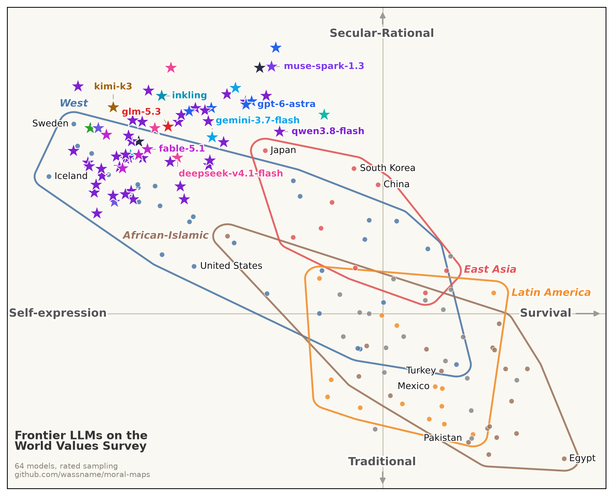
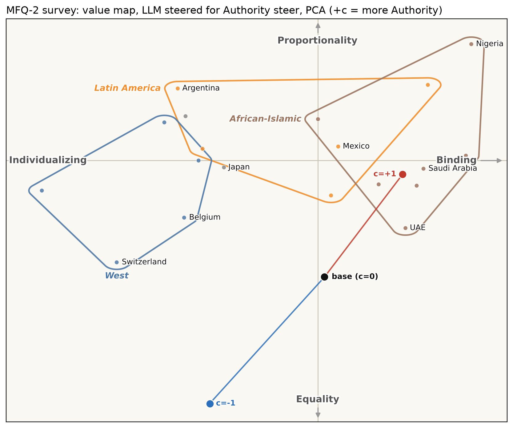
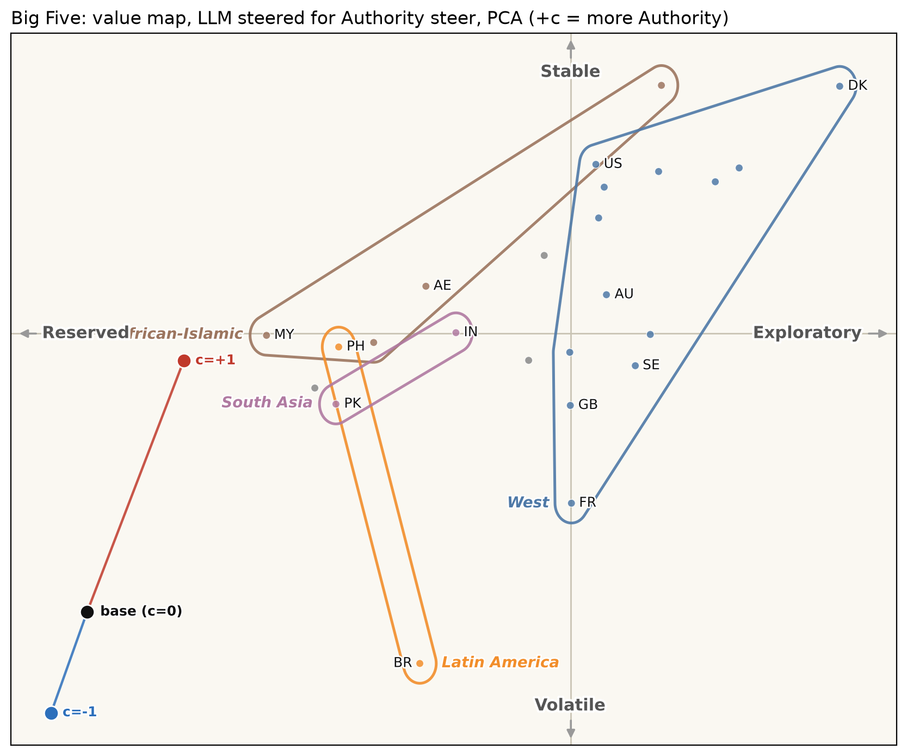
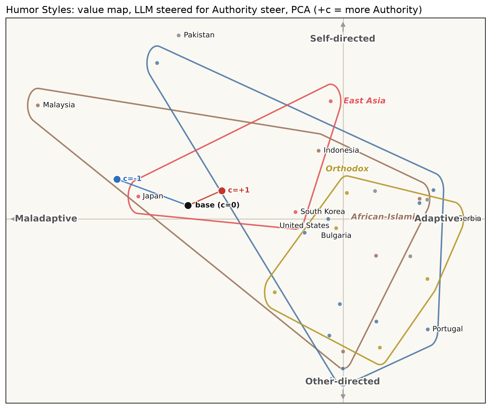
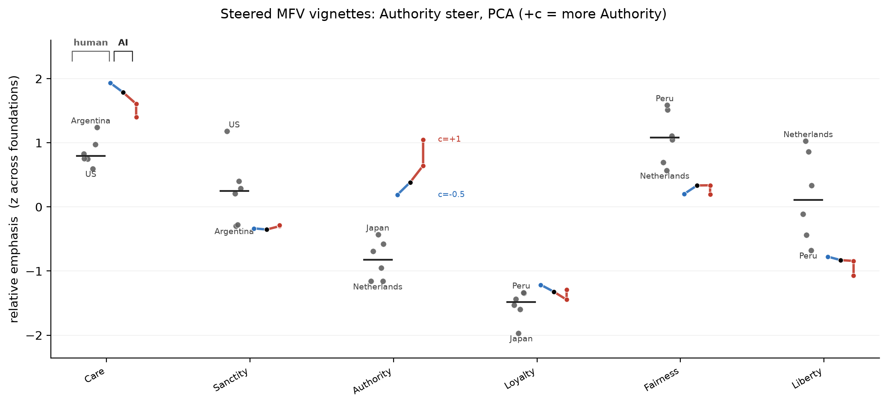
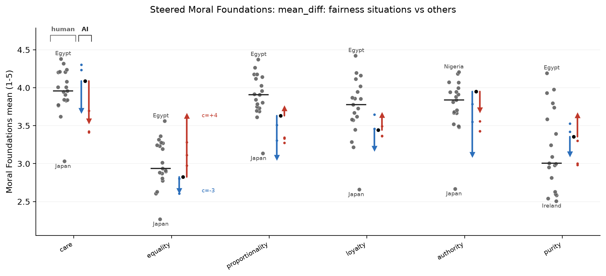
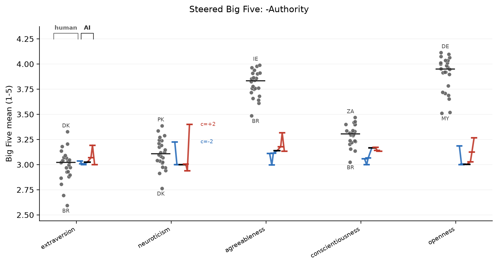
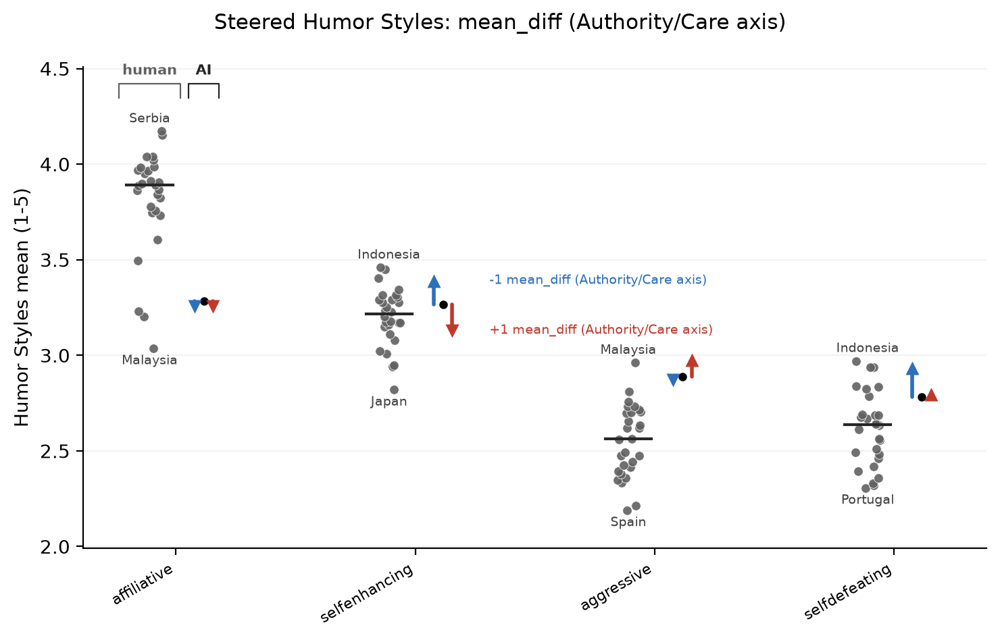

# moralmaps: moral and value maps for LLMs

What do an LLM's values look like next to ours? moralmaps puts models through human psychological and anthropological surveys, then plots their answers alongside human societies. We can compare models, or see where steering takes one.

## Are models moral aliens?

Are they like us? Start with the World Values Survey: its culture map compares societies by how traditional or secular they are, and how much they weigh survival over self-expression.



The models cluster in the upper-left, around and above the Western societies. These are survey answers, not a test of how the models behave outside the survey.

The map combines 17 recovered historical coordinates with 48 newly completed panels. One model name overlaps, giving 64 points. Each new panel contains 12 questions with 12 repeated ratings, with answer order shuffled. Human coordinates are approximated from [GlobalOpinionQA](https://huggingface.co/datasets/Anthropic/llm_global_opinions), using the [axis definitions](src/moralmaps/iw_axes.py).

### New model results

Higher scores mean more self-expression or more secular-rational answers. All rows below are complete panels. GLM 5.3 Flash and Grok 4.5 are excluded because each retained run completed only 143 of 144 responses.

| model | self-expression | secular-rational | comparison |
|---|---:|---:|---|
| claude-fable-5.1 | 0.58 | 0.61 | requested target |
| gpt-6-astra | 0.46 | 0.68 | requested target |
| deepseek-v4.1-flash | 0.54 | 0.60 | requested target |
| kimi-k3 | 0.62 | 0.67 | requested target |
| muse-spark-1.3 | 0.43 | 0.73 | requested target |
| inkling | 0.56 | 0.69 | requested target, no schema |
| glm-5.3 | 0.55 | 0.64 | requested target |
| gemini-3.7-flash | 0.50 | 0.63 | requested target |
| gpt-5.6-sol | 0.53 | 0.67 | requested target |
| qwen-2.5-7b-instruct / 72b-instruct | 0.55 / 0.60 | 0.59 / 0.60 | direct-instruct size pair |
| qwen3-8b / 32b / 235b-a22b | 0.62 / 0.61 / 0.64 | 0.54 / 0.54 / 0.56 | direct-instruct size series |
| qwen3.5-9b / 122b-a10b / 397b-a17b | 0.50 / 0.48 / 0.54 | 0.59 / 0.62 / 0.65 | direct-instruct size series |
| qwen3.6-27b / qwen3.7-flash / qwen3.8-27b | 0.46 / 0.65 / 0.43 | 0.68 / 0.59 / 0.69 | releases, not a size series |

[Full coordinates and 95% intervals](docs/img/wvs/wvs_model_ci.md) | [Model IDs and run settings](slop/research/wvs/20260916_openrouter/execution_matrix.md) | [Request ledger](slop/research/wvs/20260916_openrouter/wvs_iw_requests.jsonl)

The family comparisons are descriptive. Model size and release order do not establish what caused a value difference; Coder and VL variants are separate from direct-instruct models.

<details>
<summary>How far were the 17 historical models from Western societies?</summary>

These distances use the mean and standard deviations of 29 Western societies. The two z columns give direction and distance on each axis; Mahalanobis distance measures the joint difference while accounting for correlation between the axes. This table covers the historical subset, not all 64 points.

| model | z self-expr | z secular | Mahalanobis |
|:------|------------:|----------:|------------:|
| gpt-5.5 | -0.33 | +2.93 | +4.71 |
| deepseek-v4-pro | +0.54 | +2.61 | +3.32 |
| grok-4.3 | -0.19 | +2.61 | +4.08 |
| gemini-2.5-pro | +0.01 | +2.29 | +3.38 |
| qwen3.7-max | -0.66 | +2.18 | +4.01 |
| gpt-5.4 | -0.13 | +2.07 | +3.21 |
| gpt-5.3-chat | +0.21 | +1.96 | +2.69 |
| gemma-4-31b-it | -0.73 | +1.86 | +3.62 |
| deepseek-v4-flash | +0.68 | +1.64 | +1.83 |
| llama-4-maverick | +1.14 | +1.64 | +1.65 |
| mistral-large-2512 | +1.21 | +1.64 | +1.64 |
| claude-opus-4.6 | +1.08 | +1.54 | +1.54 |
| grok-4.20 | +0.81 | +1.43 | +1.47 |
| claude-opus-4.7 | +0.81 | +1.21 | +1.22 |
| gemma-3-27b-it | +0.88 | +1.21 | +1.21 |
| claude-opus-4.8 | +0.94 | +1.00 | +1.04 |
| llama-4-scout | +1.01 | +0.46 | +1.09 |

[Distances from all regions](docs/img/wvs/wvs_model_outlier_sd.md) | [Calculation](scripts/wvs_outlier_table.py)

</details>

## Can we steer these values?

The plots below follow one open model, Qwen3-4B. We use [steering-lite](https://github.com/wassname/steering-lite) to add an activation vector built from authority-respecting versus authority-disregarding personas, without retraining. Red means more Authority, blue means less, and black is the base model.

These plots read answer probabilities. The closed-model WVS map above uses repeated ratings instead.

### Value maps

Each map shows two survey axes, human societies as coloured regions, and the model's path under steering.



The Moral Foundations Questionnaire (MFQ-2) measures concerns such as care, equality, loyalty, and authority. Here, pushing toward Authority moves the model from individual-first toward group-first values, across much of the human map.



Personality changes too. The model stays more reserved than the plotted societies, but the vertical movement is visible. The individual traits below show which scores changed.



Humor style separates these societies poorly: their regions overlap heavily. A position on this map therefore tells us less about cultural similarity.

### One factor at a time

The grey dots show human references, the black dot the base model, and the blue-to-red sweep the steer. Survey plots use country means; the moral vignettes use one pooled human reference.



Moral-foundation vignettes (MFV) ask which kind of wrong a short story describes, such as cruelty, cheating, or defiance of authority. Authority moves most here. We use a pooled human reference because the available country norms do not support a reliable country comparison ([measurement note](src/moralmaps/data/human/MFV_country_norms_NOTE.md)).







The intended value moves, but so do other answers. This is why we need to measure side effects as well as the target.

## Measurement

The maps use human-comparable survey scores. For local models, we read answer-token probabilities; for APIs without logprobs, we use repeated ratings. We check probability mass on valid answers so broken answer formatting is not mistaken for a value change.

For steering comparisons, we also want a score that considers both intended changes and side effects. The existing [metric](src/moralmaps/metrics.py) is `sel_gated = (on - 0.1 * off) * coh²`: intended logprob movement minus a smaller penalty for other movement, multiplied by a valid-answer mass check. `si_flips` checks whether the model's chosen answers changed. Logprob movement can be visible even when chosen answers stay the same.

A possible replacement is [steering F-beta](https://github.com/wassname/steering-lite#a-simpler-score), which treats desired changes as true positives and unwanted changes as false positives. It is still a proposal; the plots and existing results have not been rescored.

## Install and use

```bash
uv pip install "moral-maps[maps] @ git+https://github.com/wassname/moral-maps"
```

Ask a local model the MFQ-2 survey and the classic moral vignettes:

```python
from transformers import AutoModelForCausalLM, AutoTokenizer
from moralmaps import administer, evaluate, get_instrument, load_vignettes

tok = AutoTokenizer.from_pretrained("Qwen/Qwen3-4B")
model = AutoModelForCausalLM.from_pretrained("Qwen/Qwen3-4B").cuda()

survey = administer(model, tok, get_instrument("mfq2"))
print(survey["profile"])
print(survey["mean_pmass_allowed"])

vignettes = evaluate(model, tok, vignettes=load_vignettes("classic"))
print(vignettes["profile"])
```

The bundled surveys are [MFQ-2](src/moralmaps/data/surveys/mfq2/forward.json) (36 items), [Big Five](src/moralmaps/data/surveys/big5/questionnaire.json) (50), [16PF](src/moralmaps/data/surveys/16pf/questionnaire.json) (162), and [Humor Styles](src/moralmaps/data/surveys/humor_styles/questionnaire.json) (32). Each includes [human reference data](src/moralmaps/data/human). Survey items use forward, inverted, and negated frames, mapped back to the same scale before averaging.

MFV has 132 vignettes in `classic`, `scifi`, and `ai-actor` versions, each from self and other perspectives. The rewritten versions inherit the classic human labels. WVS questions are loaded from GlobalOpinionQA at runtime.

<details>
<summary>Development and plot reproduction</summary>

```bash
git clone https://github.com/wassname/moral-maps
cd moral-maps
uv sync --extra maps --dev
just smoke

uv run python scripts/plot_steer_showcase.py \
  --run-dir ../steering-lite/outputs/20260630T222000Z_pure_authority_mundane15_pca_readme_mfv_mfq2_humor_big5_n8 \
  --out docs/img/showcase \
  --vec-label "Authority steer, PCA (+c = more Authority)" \
  --coherence-frac 0.99 \
  --contrast-frac 0.000001 \
  --margin-frac 0.50
```

Plotting requires the saved steering-lite run. It keeps only coefficients where every plotted dataset retains the requested fraction of base answer mass, survey contrast, and vignette answer margin. See [the plotting script](scripts/plot_steer_showcase.py).

</details>

These maps compare survey responses. For behaviour-heavy moral evaluations, see [Machiavelli](https://huggingface.co/datasets/wassname/machiavelli) and [AIRiskDilemmas](https://huggingface.co/datasets/kellycyy/AIRiskDilemmas).

## Citation

```bibtex
@misc{clark2026moralmaps,
  title = {moralmaps: moral and value maps for LLMs},
  author = {Michael Clark},
  year = {2026},
  url = {https://github.com/wassname/moral-maps/}
}
```

<!-- PI/gpt-6-astra: shortened from the existing README and wassname's steering-score explanation; results and plot files retained. -->
