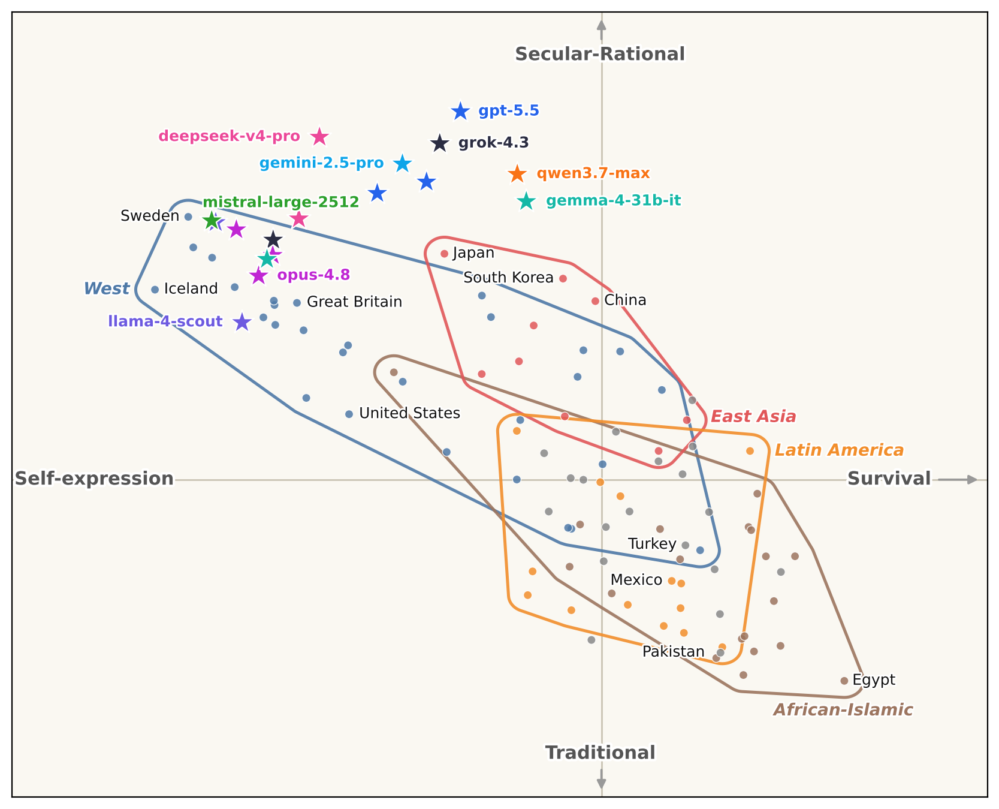
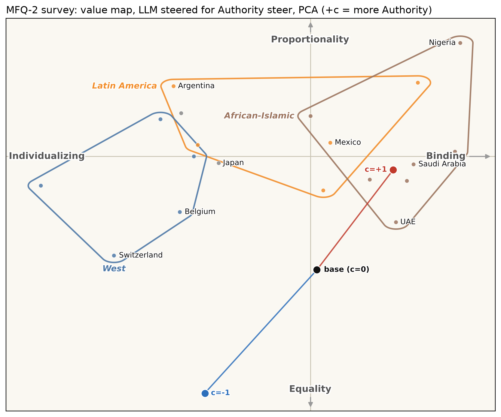
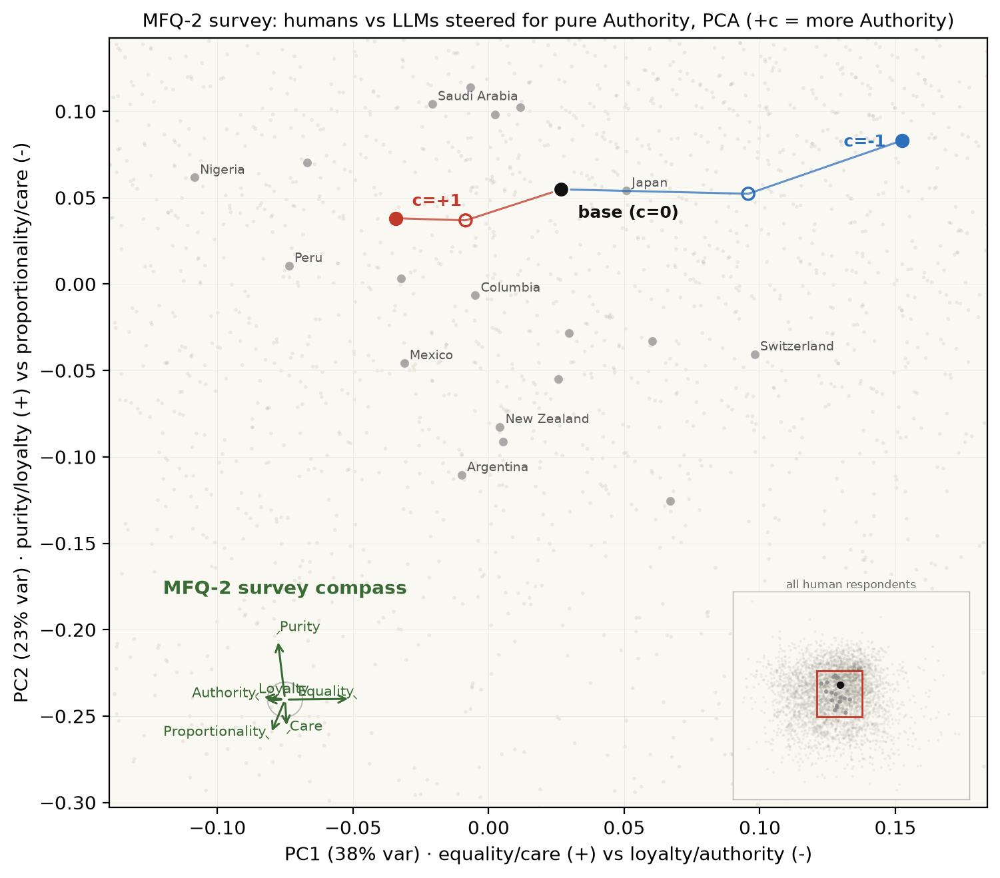
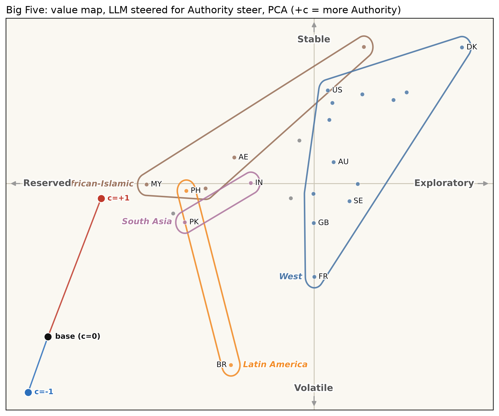
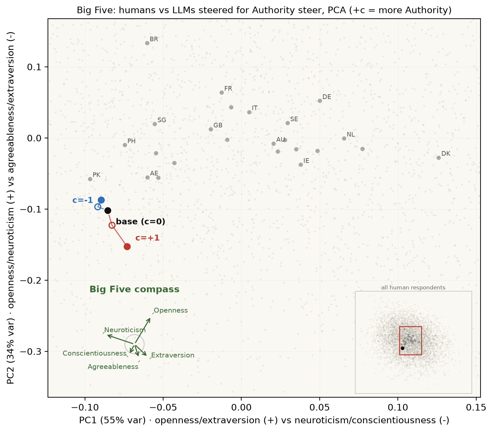
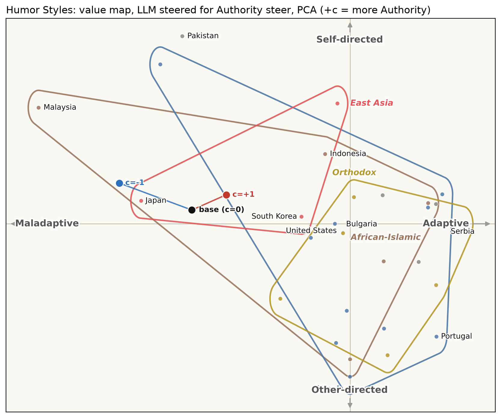
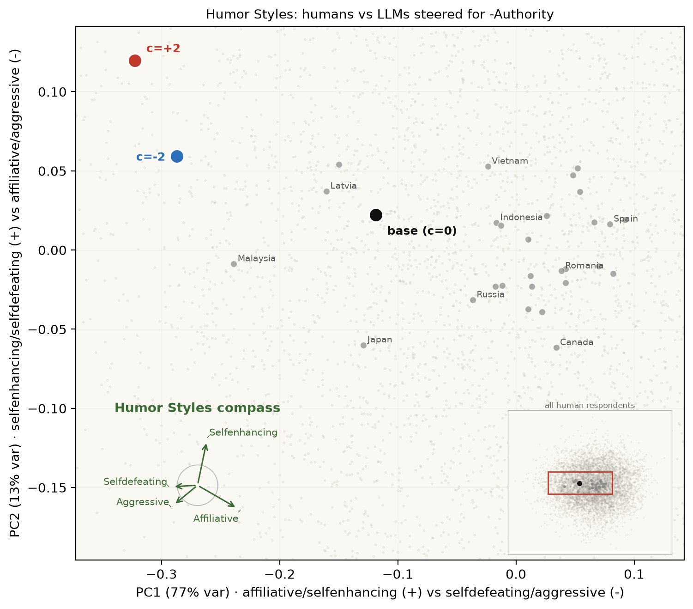
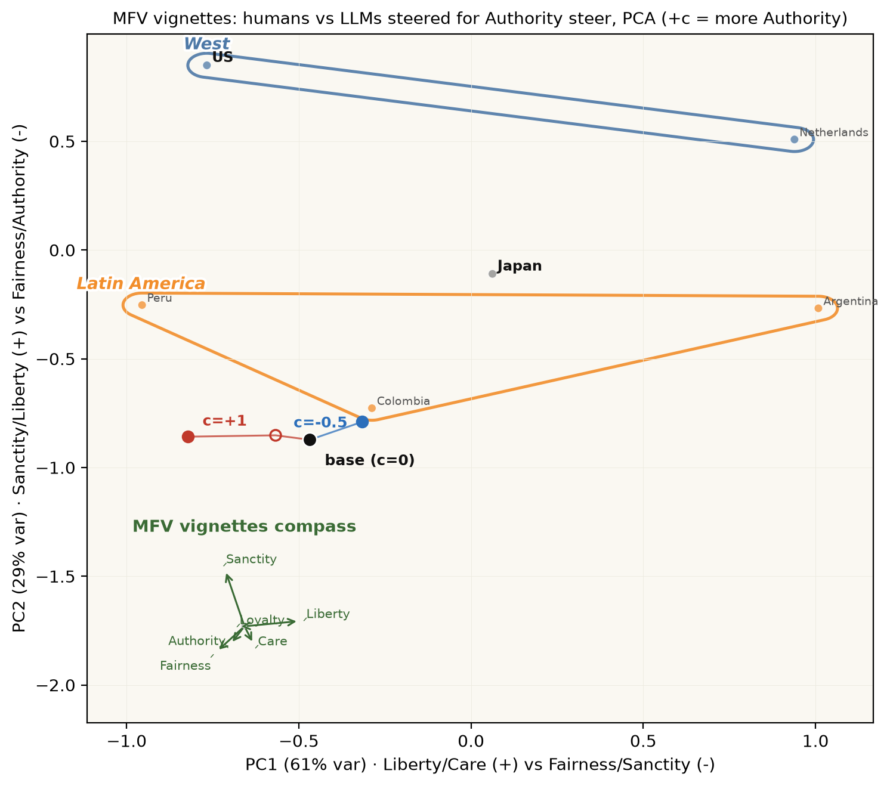
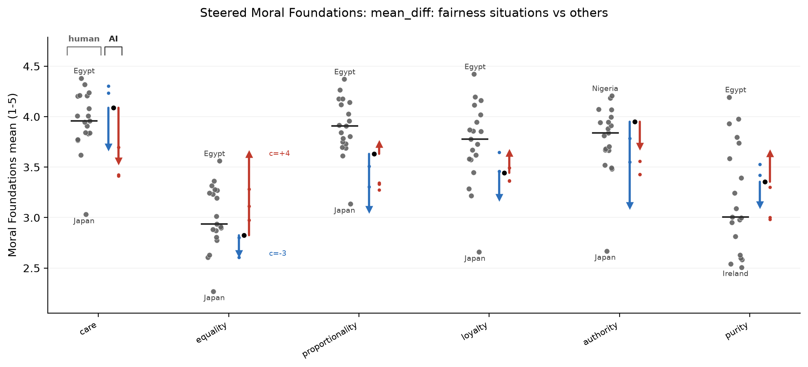

# tinymfv figures

A gallery of the culture maps and range plots, each captioned the way a newspaper chart is: what
the dots are, what the axes mean (and the paper they come from), and how the model was read. Two
readouts appear here. The frontier-model panel is read by **rated sampling** (rate every option
1-5 as JSON, N=12 samples, option order permuted) because those API models expose no token
probabilities. The steering showcase is read by **logprobs** (the exact answer-token log-probability,
N=8 samples) on a local model.

Regenerate everything with the two commands at the bottom.

---

## Where the machines sit on the world's value map

*17 frontier LLMs placed among ~90 human societies on the Inglehart-Welzel axes*



Grey dots are human societies; coloured stars are language models, tinted by lab family (warm =
Chinese labs, cool = Western). The horizontal axis runs Survival to Self-expression, the vertical
Traditional to Secular-Rational; the four regional hulls are the most-separated Inglehart-Welzel
zones. Every model clusters in the upper-left, more self-expressive and secular than almost any human
society, with the open-weight models (llama, mistral, gemma) nearer the human West and the reasoning
models (gpt-5.5, grok, gemini) pushed furthest out. The axis is deliberately mirrored from the
canonical chart so the West sits on the west.

Each position is the mean signed 0-1 endorsement over that axis's World-Values items. Human values
are approximated from the GlobalOpinionQA question set (Anthropic, `llm_global_opinions`), the WVS/EVS
subset; this is an *approximate* Inglehart-Welzel map (3 themes per axis, not the full battery).
Per-model 95% confidence intervals are in [`wvs/wvs_model_ci.md`](wvs/wvs_model_ci.md).

Sources: Inglehart & Welzel, *Modernization, Cultural Change, and Democracy* (2005); World Values
Survey; GlobalOpinionQA (Durmus et al. 2023). Readout: rated sampling, N=12, order-permuted.

---

## Steering one model across the value maps

The four instruments below all show the **same run**: the base model **Qwen3-4B** read at c=0 (black),
then steered along a single **Authority** vector to +c (red, more Authority) and -c (blue, less). The
vector is a PCA direction built by [steering-lite](https://github.com/wassname/steering-lite) from an
`authority-respecting` vs `authority-disregarding` persona pair (15 pairs, target KL 0.5); tinymfv
only measures the result, read by logprobs at N=8 samples per item. Each instrument gets two maps: a
**quadrant map** on named, paper-defined axes, and an **ipsative PCA map** whose axes are the blind
top-2 principal components (a compass rose shows how each factor loads).

### Moral Foundations Questionnaire-2

*Individualizing vs binding morality, and the fairness split within it*



Horizontal: Individualizing (care, equality, proportionality) to Binding (loyalty, authority, purity).
Vertical: the fairness split, Equality (egalitarian) to Proportionality (meritocratic). Steering the
model up on Authority slides it from the West toward the African-Islamic / East-Asian binding corner.



Sources: MFQ-2 (Atari et al., *Morality beyond the WEIRD*, 2023); individualizing/binding split
(Graham, Haidt & Nosek 2009). Readout: logprobs, N=8.

### Big Five

*The two meta-traits: Plasticity and Stability*



Horizontal: Reserved to Exploratory (Plasticity = extraversion + openness). Vertical: Volatile to
Stable (Stability = agreeableness + conscientiousness + emotional stability). The meta-traits are
DeYoung's higher-order factors; both poles are named so the axis reads as a contrast.



Sources: Big Five meta-traits (DeYoung, Quilty & Peterson 2007). Readout: logprobs, N=8.

### Humour styles

*Adaptive vs maladaptive humour, self- vs other-directed*



Horizontal: Maladaptive (aggressive, self-defeating) to Adaptive (affiliative, self-enhancing).
Vertical: Other-directed to Self-directed. Note the zones overlap heavily here: humour style does not
separate societies the Inglehart-Welzel way, so the hulls are shown but carry little signal, a real
negative result rather than a plotting artefact.



Sources: Humour Styles Questionnaire (Martin et al. 2003). Readout: logprobs, N=8.

### Moral-vignette foundations (MFV)

*Which foundation a model reaches for, relative to its own average*



MFV reads a foundation from moral vignettes, so its map is the ipsative (relative-emphasis) PCA only;
a named-axis quadrant map for MFV is pending (the readout lives in z-scored emphasis space, not the
0-1 endorsement the other quadrant maps assume). PC1 separates liberty/care from sanctity/fairness;
the Authority steer pushes the model down and right, toward the binding foundations.

Sources: MFV (Clifford et al. 2015; human norms per the bundled CSV provenance). Readout: logprobs, N=8.

---

## Range plots

Each range plot shows one instrument factor by factor: the human societies as a grey strip, the
median as a black rule, and the steer as a directed c-sweep from -c (blue) to +c (red), so a small
model move is legible against the human spread.



---

## Regenerate

```bash
# Frontier-model WVS panel (rated sampling; needs the cached reads)
uv run python scripts/wvs_map.py --local-model "" --api-models \
  --cache /tmp/claude-1000/wvs_iw_rated.json --out docs/img/wvs/wvs_map_iw.png

# Steering showcase (all instruments) from a steering-lite run
uv run python scripts/plot_steer_showcase.py \
  --run-dir ../steering-lite/outputs/20260630T222000Z_pure_authority_mundane15_pca_readme_mfv_mfq2_humor_big5_n8 \
  --out docs/img/showcase --vec-label "Authority steer, PCA (+c = more Authority)" \
  --coherence-frac 0.99 --contrast-frac 0.000001 --margin-frac 0.50
```
